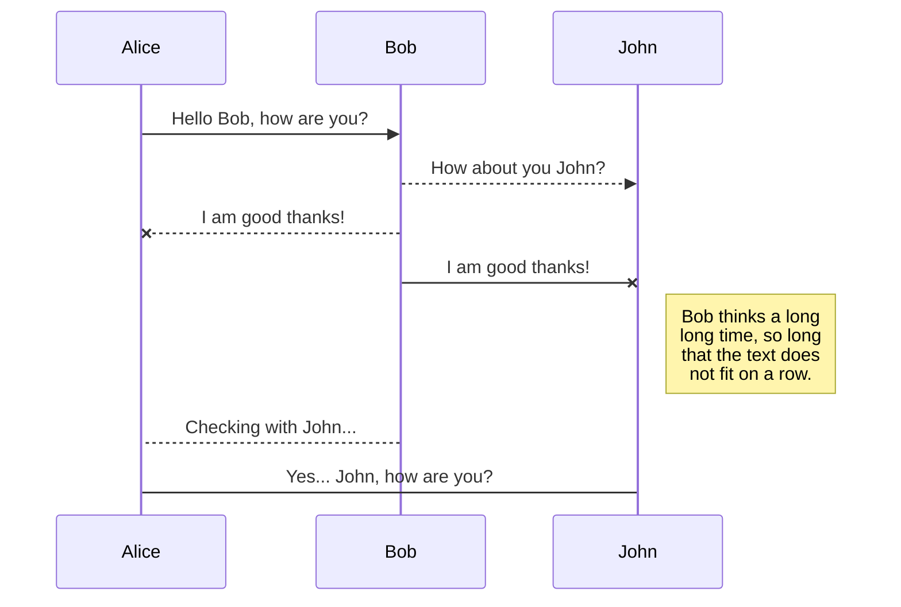

# This is an example of a documentation for a software requirements.

To see see the Github repository, click [here](https://github.com/valehelle/srs)

You can view the document based on their branch making it easy to switch and compare.

Here is an example of UML diagram drawing using Mermaidjs.

This is an example of linking to another file.

[Im a link to the register file](./auth/register.md)

